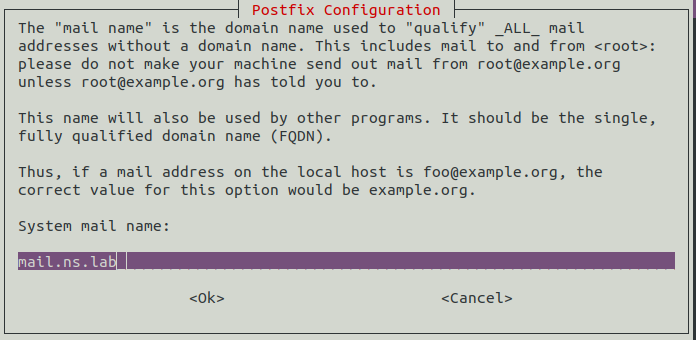

# SMTP Enumeration

### SMTP

* SMTP stands for Simple Mail Transfer Protocol and is used for sending messages to other computer users based on e-mail addresses.
* SMTP is a set of communication guidelines that allow software to transmit an electronic mail over the internet is called **Simple Mail Transfer Protocol**.
* 


### Working of SMTP


* **Composition of Mail:** A user sends an e-mail by composing an electronic mail message using a Mail User Agent \(MUA\). Mail User Agent is a program which is used to send and receive mail. The message contains two parts: body and header. The body is the main part of the message while the header includes information such as the sender and recipient address. The header also includes descriptive information such as the subject of the message. In this case, the message body is like a letter and header is like an envelope that contains the recipient's address.
* **Submission of Mail:** After composing an email, the mail client then submits the completed e-mail to the SMTP server by using SMTP on TCP port 25.
* **Delivery of Mail:** E-mail addresses contain two parts: username of the recipient and domain name. For example, user@example.com, where "user" is the username of the recipient and "example.com" is the domain name.  If the domain name of the recipient's email address is different from the sender's domain name, then MSA will send the mail to the Mail Transfer Agent \(MTA\). To relay the email, the MTA will find the target domain. It checks the MX record from Domain Name System to obtain the target domain. The MX record contains the domain name and IP address of the recipient's domain. Once the record is located, MTA connects to the exchange server to relay the message.
* **Receipt and Processing of Mail:** Once the incoming message is received, the exchange server delivers it to the incoming server \(Mail Delivery Agent\) which stores the e-mail where it waits for the user to retrieve it.
* **Access and Retrieval of Mail:** The stored email in MDA can be retrieved by using MUA \(Mail User Agent\). MUA can be accessed by using login and password.

### SMTP enmuration techniques

SMTP provides 3 build-in-commands for enmurating users:

* VRFY : mean validates users
* EXPN : Tells the actual delivery address of aliases and mailing lists
* RCPT TO : Defines the recipients of the message

Difference in response help in determining whether a user is valid or not.

#### Setting up Vulnix from Vulnhub

Download the vm image from vulnhub and find out its ip. After run a nmap scan on the ip assigned to the Vulnix.

```text
$ nmap -sC -sV 192.168.43.165
```


1. **Metasploit Way :** Metasploit provides various modules to use with SMTP. Here we are using two metasploit modules i.e. **auxiliary/scanner/smtp/smtp\_version** and **auxiliary/scanner/smtp/smtp\_enum** to find the smtp server version and to find the valid users respectively.

Open msfconsole and search for smtp. There is a smtp\_version module in auxilary scanner


```text
msf5 > use auxiliary/scanner/smtp/smtp_version 
msf5 auxiliary(scanner/smtp/smtp_version) > show options
set RHOSTS 192.168.43.165
msf5 auxiliary(scanner/smtp/smtp_version) > run

== output ==
[+] 192.168.43.165:25     - 192.168.43.165:25 SMTP 220 vulnix ESMTP Postfix (Ubuntu)\x0d\x0a
```


using smtp-enum module from auxiliary/scanner gave the list of all the users.

```text
msf5 > use auxiliary/scanner/smtp/smtp_enum
msf5 auxiliary(scanner/smtp/smtp_enum) > show options
msf5 auxiliary(scanner/smtp/smtp_enum) > set RHOSTS 192.168.43.165
msf5 auxiliary(scanner/smtp/smtp_enum) > run
```


**2. user-enum script :**  This tool uses the same commands of telnet to query the SMTP server, it takes the username from a .txt file provided as an argument and verifies whether the user is valid or not.

```text
$ ./smtp-user-enum -M VRFY -U /opt/metasploit-framework/embedded/framework/data/wordlists/unix_users.txt -t 192.168.43.165
```


**3. Netcat and telnet :** Using nc and telnet to connect to the port 25 and then running VRFY cmmand. 252 code tells that the user exists and 550 denotes that the user is invalid


**4. nmap script :** In NSE\(Nmap Scripting Enging\) we can found SMTP enumeration script SMTP-enum-users.nse


**5. NetScanTools Pro:** It's a windows tool with a graphic interface, and it is an Email Generator and Email relay testing tool.

**CheatSheet**


### Setting up your own lab environment

With root privilege add a entry as shown in /etc/hosts file.

```text
127.0.1.2    mail.prajjwal.lab
```


Installing Postfix

```text
$ sudo apt-get install postfix
```


After this a postfix configuration dialog box is shown prompting to choose the type of mail server needed.




Open **/etc/postfix/main.cf** file and make the following changes

```text
mynetworks = 127.0.0.0/8 192.168.43.1/24
inet_protocols = ipv4
home_mailbox = Maildir/
```


Restart postfix and view the open ports, note that port 25 is opn and its STATE is LISTEN.

```text
$ sudo service postfix restart
$ netstat -tnl
```


Install  & Configure Dovecot

```text
$ sudo apt-get install dovecot-imapd dovecot-pop3d
```

```text
$ sudo gedit /etc/dovecot/conf.d/10-auth.conf

Uncomment the following lines
#disable_plaintext_auth = yes

Change auth_mechanish from plain to plain login
auth_mechanism = plain login

$ sudo gedit /etc/dovecot/conf.d/10-mail.conf

change the mail location as
mail_location = maildir:/home/%u/Maildir

$ sudo gedit /etc/dovecot/conf.d/10-master.conf

Uncomment inet_listner imap port
port = 143

Uncomment inet_listner pop3 port
port = 110

Give permission to unix_listner auth-userdb
unix_listner auth-userdb {
    mode = 0600
    user = postfix
    group = postfix
}
```

changes in 10-auth.conf


changes in 10-mail.conf


changes in 10-master.conf


restart dovecot and check for open ports

```text
$ sudo service dovecot restart
$ netstat -tnl
```


Setting Mail accounts in Thunderbird manual settings


Confirm the security exception and check that the lab is properly setup. Nmap scans gives port 25 as open denoting that smtp service is running.


